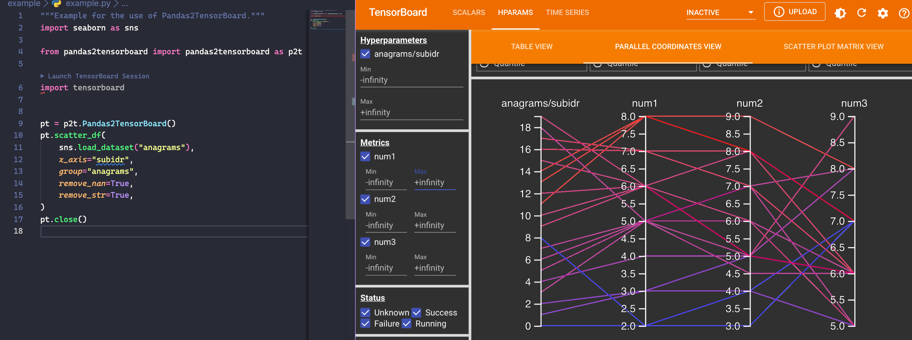

[](https://github.com/Anselmoo/pandas2tensorboard/actions/workflows/python-ci.yml)
[](https://codecov.io/gh/Anselmoo/pandas2tensorboard)
[](https://pypi.org/project/pandas2tensorboard/)

# Pandas2TensorBoard

`Pandas2TensorBoard` is a library for transforming the [pandas DataFrame][1]
into the data fomrat of [TensorBoard][2]. `Pandas2TensorBoard` relies on
[torch utilities][3] for the data transformation.



## Installation

- Regular installation via `pip`:

  ```shell
  pip install pandas2tensorboard
  ```

- With [modin][4] backend for `pandas`

  ```shell
  pip install pandas2tensorboard[modin]
  ```

- With [Dask][5] and [omnisci][6] support for `pandas`

  ```shell
  pip install pandas2tensorboard[backend]
  ```

- With [Dask][5] and [omnisci][6] support for `pandas` and [modin][4] backend for `pandas`

  ```shell
  pip install pandas2tensorboard[all]
  ```

## Usage

Currently the following types of export from `pandas` to `tensorboard` are
supported:

- `pd.DataFrame` &rarr; `scalars`
- `pd.DataFrame` &rarr; `scalars` with timestamp
- `pd.DataFrame` &rarr; `scatter` via hyperparameters

For initializing the `pandas2tensorboard` library, the current syntax of Torch's
[tensorboard.SummaryWriter][7] is used.

### Examples

1. Exporting a regular `pd.DataFrame` to `tensorboard` by removing columns with `str`:

   ```python
   import seaborn as sns

   from pandas2tensorboard import pandas2tensorboard as p2t

   pt = p2t.Pandas2TensorBoard()
   pt.regular_df(
       sns.load_dataset("planets"),
       label="planets",
       remove_nan=True,
       remove_str=True,
   )
   pt.close()
   ```

2. Exporting a `pd.DataFrame` with time column to `tensorboard`:

   ```python
   import seaborn as sns

   from pandas2tensorboard import pandas2tensorboard as p2t

   pt = p2t.Pandas2TensorBoard()
   pt.timeseries_df(
       sns.load_dataset("attention"),
       time="score",
       label="attention",
       remove_nan=True,
       remove_str=True,
       time_convert=True,
   )
   pt.close()
   ```

   > The time column with name `score` is transformed into `float` with timestamp.

3. Exporting a `pd.DataFrame` with hyperparameters to `tensorboard`:

   ```python
   import seaborn as sns

   from pandas2tensorboard import pandas2tensorboard as p2t

   pt = p2t.Pandas2TensorBoard()
   pt.scatter_df(
       sns.load_dataset("anagrams"),
       x_axis="subidr",
       group="anagrams",
       remove_nan=True,
       remove_str=True,
   )
   pt.close()
   ```

   > The `x-axis` corresponds to `hparam_dict`; the dataframe without column
   > `x_axis="subidr"` corresponds to `metric_dict`.

## Contributing

Please feel free to open an [issue][8] or create a [pull request][9]; see also [contributing][10].

## License

Check [MIT][11]

[1]: https://pandas.pydata.org/pandas-docs/stable/reference/api/pandas.DataFrame.html
[2]: https://www.tensorflow.org/tensorboard/get_started
[3]: https://pytorch.org/docs/stable/tensorboard.html
[4]: https://modin.readthedocs.io/en/stable/
[5]: https://dask.org/
[6]: https://github.com/Quansight/intake-omnisci
[7]: https://pytorch.org/docs/stable/_modules/torch/utils/tensorboard/writer.html#SummaryWriter
[8]: https://github.com/Anselmoo/pandas2tensorboard/issues
[9]: https://github.com/Anselmoo/pandas2tensorboard/pulls
[10]: https://github.com/Anselmoo/pandas2tensorboard/blob/main/CONTRIBUTING.md
[11]: https://github.com/Anselmoo/pandas2tensorboard/blob/main/LICENSE
